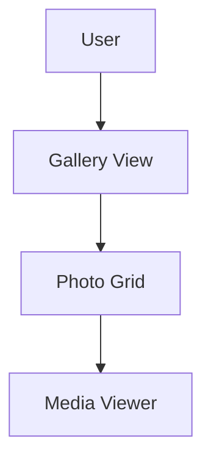

# Documentation Standards

## Overview

This is a **SaaS (Software as a Service) application**. All documentation must be created in the `/docs` folder following strict nomenclature and file structure standards.

## Documentation Location

- **Primary location**: `/docs` folder
- **Never create**: Root-level markdown files for documentation (except README.md)
- **Steering files**: `.kiro/steering/*.md` for agent guidance only

## File Naming Conventions

### Use SCREAMING_SNAKE_CASE for documentation files:
- `FEATURE_NAME.md` - Feature documentation
- `API_INTEGRATION.md` - API integration guides
- `DEPLOYMENT_GUIDE.md` - Deployment instructions
- `TROUBLESHOOTING.md` - Common issues and solutions
- `CHANGELOG.md` - Version history and changes
- `ARCHITECTURE.md` - System architecture documentation

### Examples:
- ✅ `docs/USER_AUTHENTICATION.md`
- ✅ `docs/PHOTO_UPLOAD_FLOW.md`
- ✅ `docs/AI_INTEGRATION.md`
- ❌ `docs/user-authentication.md`
- ❌ `docs/photoUploadFlow.md`
- ❌ `UserAuthentication.md` (wrong location)

## Documentation Structure

### Required Sections

Every documentation file should include:

1. **Title** (H1) - Clear, descriptive title
2. **Overview** - Brief summary of the topic
3. **Purpose** - Why this exists/what problem it solves
4. **Implementation Details** - How it works
5. **Usage Examples** - Code samples and use cases
6. **Related Files** - Links to relevant code files
7. **Last Updated** - Date of last modification

### Template

```markdown
# Feature Name

## Overview
Brief description of what this document covers.

## Purpose
Why this feature/component exists and what problems it solves.

## Implementation Details
Technical details about how it works.

## Usage Examples
\`\`\`typescript
// Code examples here
\`\`\`

## Related Files
- `/path/to/component.tsx`
- `/path/to/service.ts`

## Last Updated
YYYY-MM-DD
```

## Documentation Categories

### `/docs/features/`
Feature-specific documentation:
- `GALLERY_MANAGEMENT.md`
- `CLIENT_PORTAL.md`
- `ALBUM_DESIGNER.md`
- `AI_FEATURES.md`
- `FACE_TAGGING.md`

### `/docs/architecture/`
System architecture and design:
- `SYSTEM_OVERVIEW.md`
- `DATA_FLOW.md`
- `STATE_MANAGEMENT.md`
- `ROUTING_ARCHITECTURE.md`

### `/docs/api/`
API documentation:
- `GEMINI_INTEGRATION.md`
- `BACKEND_ENDPOINTS.md`
- `AUTHENTICATION_API.md`

### `/docs/deployment/`
Deployment and operations:
- `DEPLOYMENT_GUIDE.md`
- `ENVIRONMENT_SETUP.md`
- `DOCKER_CONFIGURATION.md`

### `/docs/development/`
Development guides:
- `GETTING_STARTED.md`
- `CODING_STANDARDS.md`
- `TESTING_GUIDE.md`
- `CONTRIBUTION_GUIDE.md`

## SaaS-Specific Documentation

### Multi-Tenancy
Document how the application handles multiple photographer accounts:
- Data isolation strategies
- Tenant identification
- Resource allocation

### Subscription & Billing
Document subscription tiers and billing:
- Feature availability by tier
- Usage limits and quotas
- Billing integration

### Performance & Scalability
Document how the system scales:
- Caching strategies
- CDN usage
- Database optimization
- Load balancing

### Security & Compliance
Document security measures:
- Authentication flows
- Authorization rules
- Data encryption
- GDPR compliance
- SOC 2 considerations

## Code Documentation

### Inline Comments
- Use JSDoc for functions and components
- Explain "why" not "what"
- Document complex algorithms
- Note security considerations

### Component Documentation
```typescript
/**
 * AlbumGrid - Displays a grid of photo albums
 * 
 * @description
 * Responsive grid component that shows album thumbnails with metadata.
 * Supports lazy loading and virtual scrolling for performance.
 * 
 * @example
 * <AlbumGrid 
 *   albums={albums} 
 *   onAlbumClick={handleClick}
 *   viewMode="grid"
 * />
 * 
 * @see /docs/features/GALLERY_MANAGEMENT.md
 */
```

## Documentation Maintenance

### When to Update Documentation
- After implementing new features
- When changing existing functionality
- After fixing significant bugs
- When updating dependencies
- After architecture changes

### Review Process
- Documentation should be reviewed alongside code
- Keep documentation in sync with implementation
- Remove outdated documentation promptly
- Update "Last Updated" dates

## Documentation Tools

### Diagrams
Use Mermaid for diagrams in markdown:



### Code Snippets
- Use syntax highlighting
- Include imports
- Show complete, runnable examples
- Add comments for clarity

## Best Practices

### Do's
- ✅ Write clear, concise documentation
- ✅ Use consistent terminology
- ✅ Include code examples
- ✅ Link to related documentation
- ✅ Keep documentation up to date
- ✅ Use proper file naming (SCREAMING_SNAKE_CASE)
- ✅ Organize by category in subfolders

### Don'ts
- ❌ Don't create documentation outside `/docs`
- ❌ Don't use inconsistent naming conventions
- ❌ Don't duplicate information across files
- ❌ Don't leave outdated documentation
- ❌ Don't document implementation details that change frequently
- ❌ Don't create summary files after completing work (unless explicitly requested)

## Special Cases

### Temporary Documentation
For work-in-progress or temporary notes:
- Use `/docs/temp/` folder
- Prefix with `TEMP_`
- Delete when no longer needed

### Migration Documentation
When refactoring or migrating:
- Document old and new approaches
- Include migration steps
- Note breaking changes
- Provide timeline

## Agent Behavior

### When Creating Documentation
1. Always use `/docs` folder
2. Follow SCREAMING_SNAKE_CASE naming
3. Use appropriate subfolder category
4. Include all required sections
5. Add "Last Updated" date
6. Link to related files

### When Completing Work
- **Do NOT** create summary markdown files automatically
- Only create documentation if explicitly requested
- Update existing documentation if changes affect it
- Remove temporary documentation files

## Resources

- Project README: `/README.md`
- Steering files: `/.kiro/steering/`
- Component examples: `/components/`
